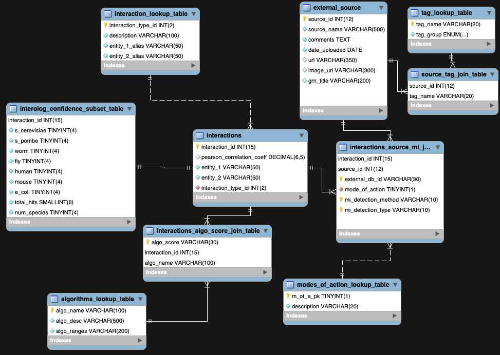

## INTRODUCTION

A part of the [BAR's](https://www.bar.utoronto.ca) modernization effort and creating a new gene network visualization tool, I have decided to re-factor our interactions database. Under Professor Nicholas Provart's permission, the data has been released to the public - i.e. our in-house protein-protein and protein-DNA interaction database is free for others to use. Namely, our [interolog data](https://www.ncbi.nlm.nih.gov/pubmed/17675552) and other kindly donated data from other labs which totals <b>over 3 million interactions</b>.

Project contains raw TSV file (purified databse dump, scripts, and unit tests) for the migration to a new schema for storing and fetching interactions. The rationale behind database re-design was to decouple multiple mappings (i.e. delimited values in a column which require inefficient LIKE leading wildcard queries [indexes can't be used]), integrate lookup tables for future referencing, add curation fields, optimization (various ways including deleting many NULL fields by collapsing NOT NULL rows into a sub-table) and allowing expansion for gene network fetching.

SQL queries powered by Knex. Unit tests powered by Jest.

Notes regarding files:

| File          | Description           |
| ------------- | -------------         |
| finalDump_2019-05-14.tsv.zip | Purified TSV file containing old migrated DB data, 'the truth' - curated by Eddi Esteban. Note the date of last update.|
|finalDumpDocumentation.txt| Accompanying documentation for each column in header row of TSV, from Eddi. |
| schema.sql    | SQL schema for the new database, forward engineered from MYSQL workbench | 
| package.json | JSON of necessary files needed to be installed, enter: `npm i` | 
| insertIntoTables.js | Sole script file that will read TSV file above to make insertions into database `node insertIntoTables.js` |
| verifications.test.js | Unit tests to be ran after script INSERTions are completed. Run: `npm run test` see below to run tests individually |
| ints\_DB\_migration\_jun\_13\_2019.sql.zip | MYSQL dump of the database (5.7). Note date of last update. If you need an updated copy, contact the BAR. ** UNINDEXED, RENAME AND CREATE YOUR OWN DB BEFORE IMPORTING! ** |
| BAR\_new\_itrns\_db.mwb | MYSQL Workbench file, namely an ERD that visualizes the relationships between the tables. Contains brief descriptions of each column. |
| itrns_db_idxes.sql | Suggested indexes to add to the database after importing. |

## ERD Design Explantions

<em>Note that some of the keys next to columns are incorrectly shown due to a bug in MySQL workbench, upload the MWB file to Workbench to verify the keys</em>

### Interactions Type Lookup Table (interactions\_lookup_table)

A lookup table which standardizes and references the different types of interactions we host in this database. The most canonical example is a protein-protein interaction wherein one protein binds to another, therefore the alias of *entity\_1_alias* and *entity\_2_alias* would be 'protein'. However as interactions can be wide-encompassing due to the concept of a metagene (a gene's protein product, mRNA, promoter, etc) having a lookup table allows expandiablity for future interaction types (consider how prevalent miRNA-mRNA interactions have become in the last decade).

### Interactions Table (interactions)

The 'meat' of our database. A table summarizing how one entity is related to another entity (i.e. interact), doesn't usually refer interactions of a metagene but usually does. Surrogate key chosen over a 3-column composite key for simplicity. Note the unique index on the *entity_1*, *entity_2* and *interaction\_type_id* column to restrict redundant interactions. 

### Interolog Scores Table (interolog\_confidence\_subset\_table)

To normalize our previous database, I decided to create a subset table for the interactions (~70k) that have an interolog score. This vastly improves redundancy as we had >3M rows that had 9 columns of NULLs (i.e. we had a lot of NULL redundancy). This table and its columns represent directly the interolog score for a particular interaction for a particular species. For example, if an interaction scored '3' under worm and '10' under fly, then this interaction of its protein homologues were seen in worms and flies.

### Algorithm Lookup Table (algorithms\_lookup\_table)

In our previous (and future) database we had interactions which were predicted (e.g. the HEX algorithm). We stored these rankings arbitrarily into a column without explanation. Thus this reference table provides the necessary explanation of the numbers/rankings AND the algorthimic details for our join table.

### Algorithms Interactions Join Table (interactions\_algo\_score\_join\_table)

Since every interaction could potentially have more than one algorithm ran on it, create a join table where the algorithm name is the foreign key.

### Modes of Action Lookup Table (interactions\_algo\_score\_join\_table)

To modernize our database, include a lookup table that will include the 'directionality' of a particular interaction. That is, two genes interact, but how does the first entity modulate the other - does it repress or activate the second entity?

### Sources Table (external\_source)

Table which will store all the unique sources (usually a paper, but not always) with extra columns for future curation and for my gene network tool. Note that the source_name column is unique and thus will primarily store a pubmed ID (PMID).

### Interactions Source MI Join Table (interactions\_source\_mi\_join\_table)

A table that offers a join for interactions and sources (along with MI terms - a controlled vocabulary for experiments by EMBL). That is, one interaction can be referenced by more than one paper. This table is necessary for efficient querying of <b> (1) How many interactions exist in a paper </b> and <b> (2) Fetching the individual interactions of a paper for visualization. </b>

### Tag Lookup Table (tag\_lookup\_table)

Lookup table for each tag so we can easily categorize them for our front-end app. I.e. group tags like 'Y1H, Y2H, CHIP' under 'experiment' for categorization for the user. Note that since the tag_name is the PK and MySQL is case-insensitive by default, we won't get 'chIP' and 'CHIP' duplicated.

### Source Tag Join Table (source\_tag\_join\_table)

As one paper may have many tags, create a join table where the FKs are the source id and tag_name.

## Database migration checks:

You can run these individually via the commands below or use `npm run test` to run the whole Jest suite.

- Compare number of unique sources from TSV file to number of unique sources in 'external_source' table: `npm run test -- -t='unique_sources';`
	- To count TSV file sources (sed to skip header): `sed -e 1d finalDump_2019-05-14.tsv | cut -f 2 | sort | uniq | wc -l`
		- 2284 
 	- To count entries in src tbl: `SELECT COUNT(*) FROM external_source;`
 		- 2284

- Compare number of unique interactions (ppi and pdi) for a given AGI pair: `npm run test -- -t='unique_interactions';`
	- Count number of unique AGI-pairs: `awk 'BEGIN {FS="\t"}; {print $1, $3, $4}' finalDump_2019-05-14.tsv | grep -v "^1.0" | sed '1d' | tr [a-z] [A-Z] | sort | uniq | wc -l`
		- 3191430 
	- Count number of AGI-pairs in DB: `SELECT COUNT(*) FROM interactions`
		- 3191430

- Verify number of interolog interactions:  `npm run test -- -t='interolog_count';`
	- `SELECT  count(*) from interolog_confidence_subset_table;`
		- 70933
- Compare number of unique MI terms throughout our DB to the TSV file: ` npm run test -- -t='mi_terms_count';`
	- `sed -e 1d finalDump_2019-05-14.tsv | cut -f 5 | sort | uniq | wc -l`
		- 61 	
	- `SELECT COUNT(DISTINCT(mi_detection_method)) FROM interactions_source_mi_join_table;`
		- 61
		
### Credits:

   - Vincent Lau (dev/docs/db design), Eddi Esteban (TSV file purification). Thanks to NSERC Canada and Dr. Nicholas Provart for funding.
    
    